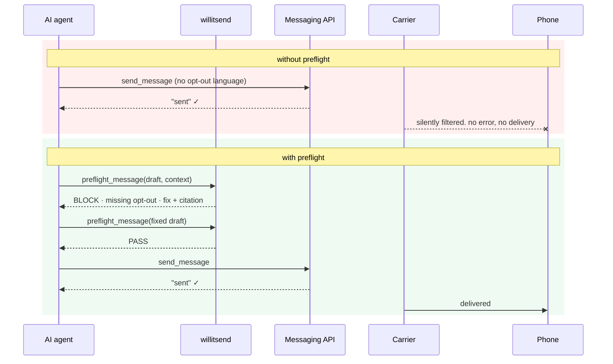
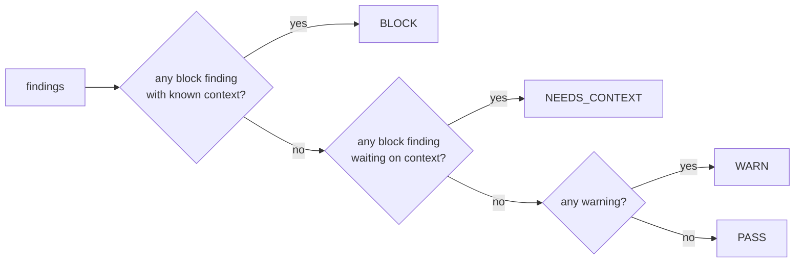

# willitsend

[](https://github.com/abryfs/willitsend/actions/workflows/ci.yml) [](LICENSE)

Your AI agent sends texts. Carriers silently drop the non-compliant ones, and the API never tells you. **willitsend is the missing check between the model and the carrier**: a deterministic preflight for outbound SMS/iMessage that catches silent filtering, segment blowups, and dropped iMessage features before you spend the send.

**[Try it in the browser](https://abryfs.github.io/willitsend/)**: runs client-side, nothing leaves the page.

```
npx -y github:abryfs/willitsend "Hey! Your appointment is tomorrow at 2pm." --first-message
```

```
Verdict: BLOCK
Segments: 1 (gsm7, 41 septets)
Channel: unknown
[BLOCK] first-message.opt-out: First message doesn't include opt-out instructions (e.g. "Reply STOP
to unsubscribe"). Carriers may silently filter first messages that lack one, with no API error.
  Fix: Append "Reply STOP to unsubscribe." to the message body.
  Source: https://docs.agentphone.ai/documentation/reference/messaging-rate-limits#first-message-requirements
[WARN] first-message.opt-in: No opt-in acknowledgment language found …
[INFO] first-message.brand: No brand_name was provided …
```

## The problem

Messaging APIs report `"sent"` when a message reaches the downstream carrier, not when it reaches a phone. AgentPhone's [rate-limit docs](https://docs.agentphone.ai/documentation/reference/messaging-rate-limits#first-message-requirements) spell out the consequence: first messages that skip brand identification, opt-in acknowledgment, or opt-out instructions "may be silently filtered by carriers. The API will not return an error."

AI agents now send texts autonomously, and nothing sits between the model and the carrier. An agent that drops the opt-out line gets no error and no delivery. An agent that adds one emoji turns a 160-character message into three billable segments and never notices.

`willitsend` is the missing check: a deterministic, stateless lint for a draft message. Text and context in, verdict and evidence out. It sends nothing and stores nothing.



## Why not just prompt the rules into your agent?

A fair question: AgentPhone's docs are agent-readable, so you could feed them into every generation call and ask the model to comply. Two things break, and one gets expensive:

1. **Generation is probabilistic; verification is deterministic.** A model with the rules in context complies *usually*. This checker returns the same verdict every time, and its failure mode is a visible finding rather than a silently filtered message. Compose-time guidance and pre-send verification are complements — this repo ships both (the [agent skill](skill/SKILL.md) is the compose-time half).
2. **Models can't do segment math.** Septet counting, GSM-7 extension characters, encoding flips from one smart quote, placement-aware packing — token-based models are structurally bad at exactly this arithmetic. No amount of prompting fixes it; a 300-line deterministic function does.
3. **The token math, measured** (char-count/4 heuristic on the actual pages, July 2026):

| Approach | Tokens per message | 10,000 msgs/day at $3/M input |
| --- | --- | --- |
| Feed both AgentPhone doc pages into each generation call | ~7,700 | ~$231/day (~$23/day with 90% prompt caching) |
| `preflight_message` call result (default) | **~250** (+ ~1,450 once per session for the tool definition) | **~$7.50/day** |
| `preflight_message` with `response_format: "concise"` | **~7 on pass, ~44 on block** (measured) | **~$0.35/day** at a 90% pass rate |

Roughly **30× fewer tokens per message** in default mode — several hundred× in concise mode — and the checker's own compute rounds to zero (~4µs locally, no API). If you compress the rules into your system prompt instead — our skill file does, at ~950 tokens — you keep the compose-time benefit but still have no verifier and no segment math. Bulk senders feel this most: the tool exists precisely for AI agents sending texts at volume.

## Quickstart

**As an MCP tool** (Claude Code):

```
claude mcp add willitsend -- npx -y -p github:abryfs/willitsend willitsend-mcp
```

or in any MCP client config:

```json
{
  "mcpServers": {
    "willitsend": {
      "command": "npx",
      "args": ["-y", "-p", "github:abryfs/willitsend", "willitsend-mcp"]
    }
  }
}
```

**For AI agents** — paste this block into your agent (or point it at this README):

```text
Install the willitsend MCP server (pre-send SMS/iMessage lint, no API key needed):
- Claude Code: run `claude mcp add willitsend -- npx -y -p github:abryfs/willitsend willitsend-mcp`
- Any other MCP client: add {"command": "npx", "args": ["-y", "-p", "github:abryfs/willitsend", "willitsend-mcp"]} to its MCP server config.
Then, before every send_message (or equivalent) call, call preflight_message with the
draft body, is_first_message_to_contact (true/false when known), and brand_name.
Treat verdict "block" as do-not-send: apply the returned fix strings and re-run until
pass. Treat "needs_context" as a signal to determine whether this is a first message
(check conversation history), never as permission to send. For high-volume loops pass
response_format: "concise" (~7 tokens on pass).
```

No API key required. Set `AGENTPHONE_API_KEY` if you want a live iMessage/SMS capabilities lookup for phone-number destinations; without it the tool runs offline. Installs come straight from this repo (a `prepare` script builds on install) — there is nothing to sign up for and no registry in the middle.

**As a library** (`npm install github:abryfs/willitsend`):

```ts
import { preflight } from "willitsend";

const report = preflight({
  body: "Acme: thanks for signing up. Your order shipped. Reply STOP to unsubscribe.",
  is_first_message_to_contact: true,
  brand_name: "Acme",
});

report.verdict; // "pass" | "warn" | "block" | "needs_context"
report.findings; // each with severity, fix, and a citation URL
report.trace.segments; // { encoding, units, segments, perSegment, ... }
```

**As a CLI:** `npx -y github:abryfs/willitsend --help`. Exit codes: `0` pass/warn, `1` block, `2` needs context, `3` usage error. It drops into CI or a shell pipeline as-is.

## What it checks

| Rule | Severity | Source |
| --- | --- | --- |
| `first-message.opt-out`: first message to a contact must carry opt-out instructions | block | [AgentPhone docs](https://docs.agentphone.ai/documentation/reference/messaging-rate-limits#first-message-requirements) |
| `first-message.brand`: first message must identify the brand (checked only against a `brand_name` you provide, never guessed) | block | [AgentPhone docs](https://docs.agentphone.ai/documentation/reference/messaging-rate-limits#first-message-requirements) |
| `first-message.opt-in`: first message should acknowledge how the contact opted in | warn | [AgentPhone docs](https://docs.agentphone.ai/documentation/reference/messaging-rate-limits#first-message-requirements) |
| `first-message.media-only`: compliance text can't ride in an image | warn | [AgentPhone docs](https://docs.agentphone.ai/documentation/reference/messaging-rate-limits#first-message-requirements) |
| `segments.unicode-blowup`: one non-GSM character re-encodes the whole message as UCS-2 | warn | [AgentPhone docs](https://docs.agentphone.ai/documentation/reference/messaging-rate-limits#daily-message-limits) |
| `imessage.feature-fallback`: `send_style`, threaded replies, and carousels drop without a trace on SMS fallback | warn | [AgentPhone docs](https://docs.agentphone.ai/documentation/guides/messages#imessage) |
| `imessage.invalid-send-style`, `imessage.carousel-count`: invalid effect names, carousels outside the documented 2-20 range | block | [AgentPhone docs](https://docs.agentphone.ai/api-reference/messages/send-message-v-1-messages-post#carousel--multi-image-imessage) |
| `imessage.new-contact-cap`: iMessage caps new-contact sends at 50/day per line | info | [AgentPhone docs](https://docs.agentphone.ai/documentation/reference/messaging-rate-limits#imessage) |
| `destination.invalid`, `destination.voip`: malformed destinations; known-VoIP lines (line type is never guessed from the number) | block / warn | [send API](https://docs.agentphone.ai/api-reference/messages/send-message-v-1-messages-post) / [AgentPhone docs](https://docs.agentphone.ai/documentation/reference/messaging-rate-limits#delivery-and-reliability) |
| `content.shaft`: sex/alcohol/firearms/tobacco terms carriers filter (hate speech has no keyword rule: word lists can't detect it and we don't pretend) | warn | [Twilio guidelines](https://www.twilio.com/en-us/guidelines/us/sms) |
| `content.url-shortener`: shared public shorteners (bit.ly, tinyurl, …) conflict with CTIA dedicated-shortener guidance | warn | [CTIA MP&BP (PDF)](https://api.ctia.org/wp-content/uploads/2023/05/230523-CTIA-Messaging-Principles-and-Best-Practices-FINAL.pdf) |
| `content.spam-patterns`: ALL-CAPS runs, `$$$`, `!!!` | info | heuristic |

Rules come in two labeled tiers. Rules sourced from AgentPhone's own documentation can block. Industry-sourced rules warn at most, because a keyword heuristic has no business vetoing your send.

### The verdict model

A finding that depends on context you didn't supply doesn't pretend to be certain. If you never say whether this is the first message to a contact, the opt-out rule reports conditionally and the verdict is `needs_context`. You get no fake pass and no fake block.



Every report also carries a **send trace**: destination classification, assumed channel (iMessage/SMS/MMS), full segment math (encoding, septet and code-unit counts, placement-aware per-segment packing), and, given a 10DLC campaign tier, what this message costs against published daily segment caps.

## Benchmarks

Reproduce every number here from the repo; none of them require an account.

- **Segment-math parity:** agrees with [Twilio's reference segment calculator](https://github.com/TwilioDevEd/message-segment-calculator) on encoding and segment count across a frozen 126-vector corpus: GSM-7/UCS-2 boundaries, extension characters, emoji, ZWJ sequences, and a deterministic fuzz sweep. The corpus and suite live in [`test/parity.test.ts`](test/parity.test.ts); run `npm test`.
- **Latency:** median ~4µs per message, ~100,000 messages/second on one thread (Node 22, Apple Silicon laptop; single-pass code-point tables, zero per-character allocation). Run `npm run bench` on yours. Preflighting every outbound message is cheaper than logging it.
- **Worked cost example, from published caps:** a sole-proprietor 10DLC campaign gets 1,000 T-Mobile segments/day (≈3,000 total US, per AgentPhone's published estimate). One stray emoji that flips a 2-segment GSM-7 message to 4 UCS-2 segments halves the number of messages that quota buys. Same text, same recipients, half the reach.

You will find no delivery-rate improvement claims here. That claim needs send data we don't have.

## What this can't do

Carriers filter with systems whose rules they don't publish. The policy layer is public (conduct codes, content categories, volume caps); the runtime filtering decisions are deliberately opaque, and only part of the outcome is observable (some blocks return explicit filter errors, some messages are accepted and silently never delivered). This tool covers the deterministic, documented layer, and nothing else:

- A `pass` is not a delivery guarantee. It means nothing *documented* will kill the message.
- The opt-in check verifies language presence, not that consent exists. Consent lives in your records, not in message text.
- Detection is English-only in v1 (findings carry a `locale` field).
- Quota math is a static illustration from published caps, not your account's live state.
- The tool never infers line type (VoIP/mobile) from a phone number. Pass `destination_line_type` from a lookup service if you have one; [libphonenumber-js](https://github.com/catamphetamine/libphonenumber-js) gives a free approximation, with known limits for US numbers.

## Prior art

- [TwilioDevEd/message-segment-calculator](https://github.com/TwilioDevEd/message-segment-calculator) is the reference for segment math. This library is tested for parity against it rather than competing with it.
- [sms_policy_checker](https://github.com/ConnorBaldes/sms_policy_checker) covers similar compliance ground for Ruby/Rails with an LLM layer; willitsend is the deterministic, zero-network counterpart.
- Web checkers (10dlccheck.com, Calilio) cover overlapping rules as human-facing forms. willitsend makes those checks embeddable: a library an agent can call a hundred thousand times a second, with citations.
- As far as we can tell, this is the first MCP tool for pre-send SMS content compliance. Corrections welcome.

## Privacy

No telemetry. No network calls, except the optional capabilities lookup you enable with an API key. The tool never logs, stores, or echoes message bodies in its output. The playground runs in your browser and sends nothing anywhere.

## Future

- The engine's natural home is server-side: a `dry_run` parameter on the send endpoint itself. The library is written to drop in, as a pure function with no state and a dependency-free core.
- Close the loop: correlate preflight verdicts with delivery-status webhooks, so rule precision is measured against real outcomes instead of assumed. Filtering is partially observable (explicit filter errors on some blocks, silence on others), which is exactly enough signal to grade a deterministic ruleset honestly. Learning the opaque layer itself takes aggregate send data across many senders; that belongs to platforms, not to a stateless client tool.
- A rendered deliverability report card via the MCP Apps extension.
- Locale packs beyond English.

## Developing

```
git clone https://github.com/abryfs/willitsend && cd willitsend
npm install   # builds via prepare
npm test      # 191 tests: unit, Twilio parity, held-out acceptance
npm run bench
```

## License

MIT
